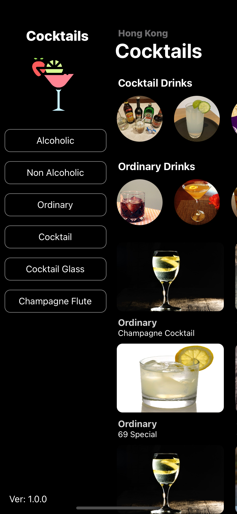

<div>
    
    
    
    
</div>

# Getting Started

```
    # Clone the project from git
    git clone https://github.com/jaydennleemc/Cocktails.git

    # Install dependencies
    yarn install

    # Run iOS
    yarn ios

    # Run android
    yarn android
```

# Cocktail Database

This app all drinks is get from 'The CocktailDB' (https://www.thecocktaildb.com/)

They provide RESET API for public but some apis needs auth with key

Please visit their website to known more, if you have interesting

# Libraries

- axios (API Client)
- react-native-router-flux (Scene Navigation)
- react-native-drawer (Drawer Menu)
- react-native-fast-image (Image Loader)
- react-content-loader (Loading animation)
- react-native-vector-icons (Icons)
